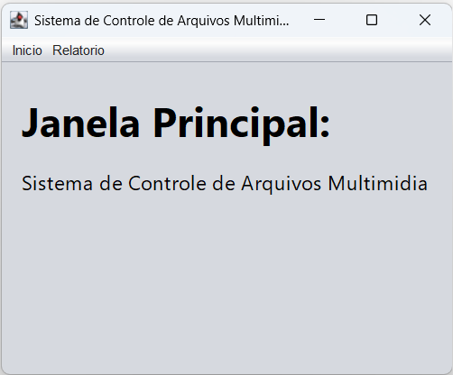
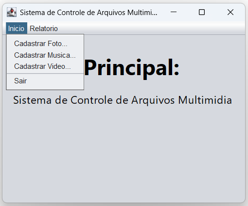
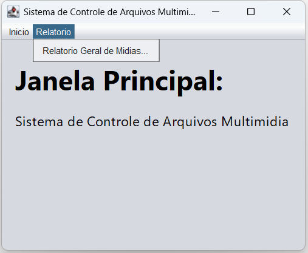
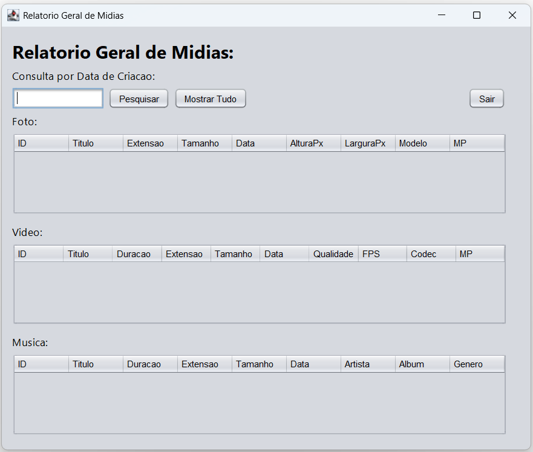
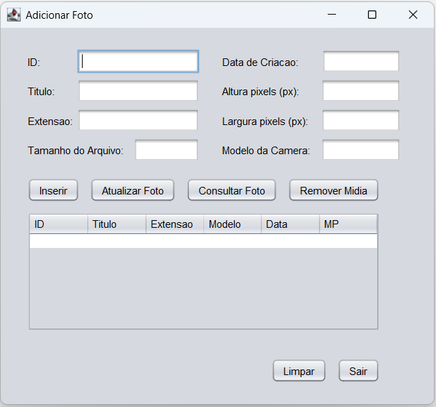
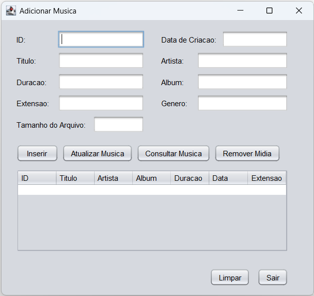
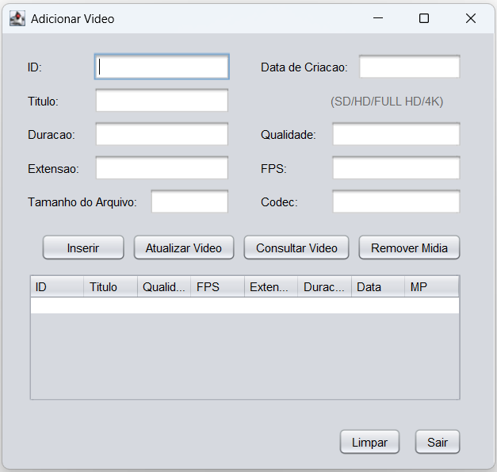
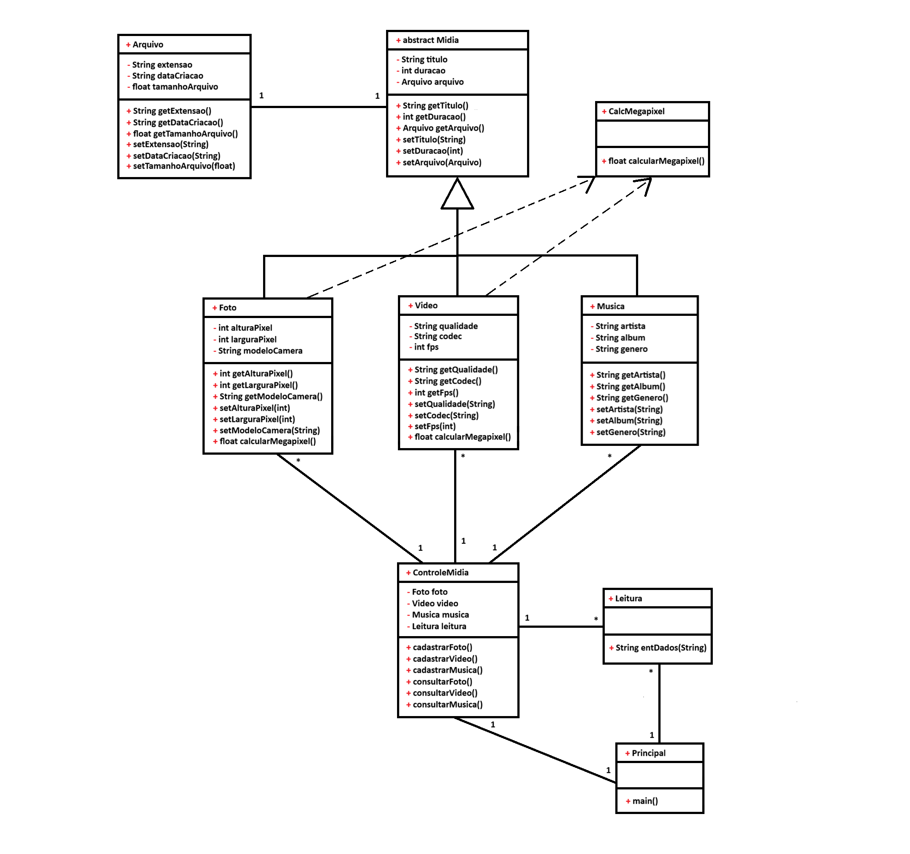

# SISTEMA DE GERENCIAMENTO DE MÍDIAS DIGITAIS
Projeto acadêmico desenvolvido em Java para a disciplina de Programação Orientada a Objetos.

## Resumo Técnico
O projeto foi desenvolvido utilizando NetBeans e Java Swing, o sistema permite o cadastro e gerenciamento de diferentes tipos de mídias digitais, como fotos, vídeos e músicas. A aplicação utiliza conceitos de POO, como herança, encapsulamento, abstração, polimorfismo e interfaces, além de exceções para validação dos dados.

## Funcionalidades 
- Cadastro de fotos
- Cadastro de vídeos
- Cadastro de músicas
- Consulta de mídias cadastradas
- Geração de relatório geral
- Consulta de relatório geral por data
- Cálculo de megapixels
- Validação de dados
  
## Screenshots

| Principal | Aba Início | Aba Relatório | Relatório Geral |
|---|---|---|---|
|  |  |  |  |

| Cadastrar Foto | Cadastrar Música | Cadastrar Vídeo | 
|---|---|---|
|  |  |  |

## Diagrama de Classes 
Desenvolvido como parte da entrega parcial do projeto, apresentando a estrutura das classes e seus principais relacionamentos.

| Diagrama de Classes | 
|---|
|  | 

